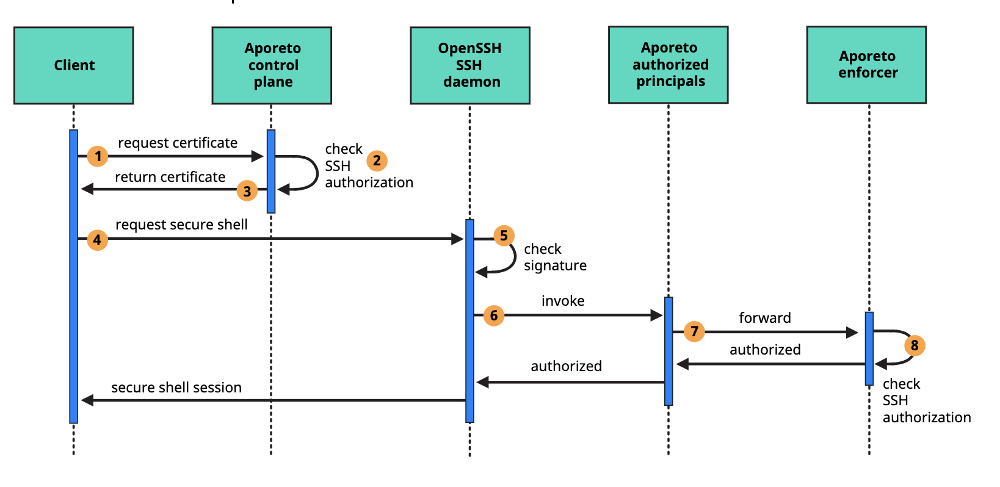
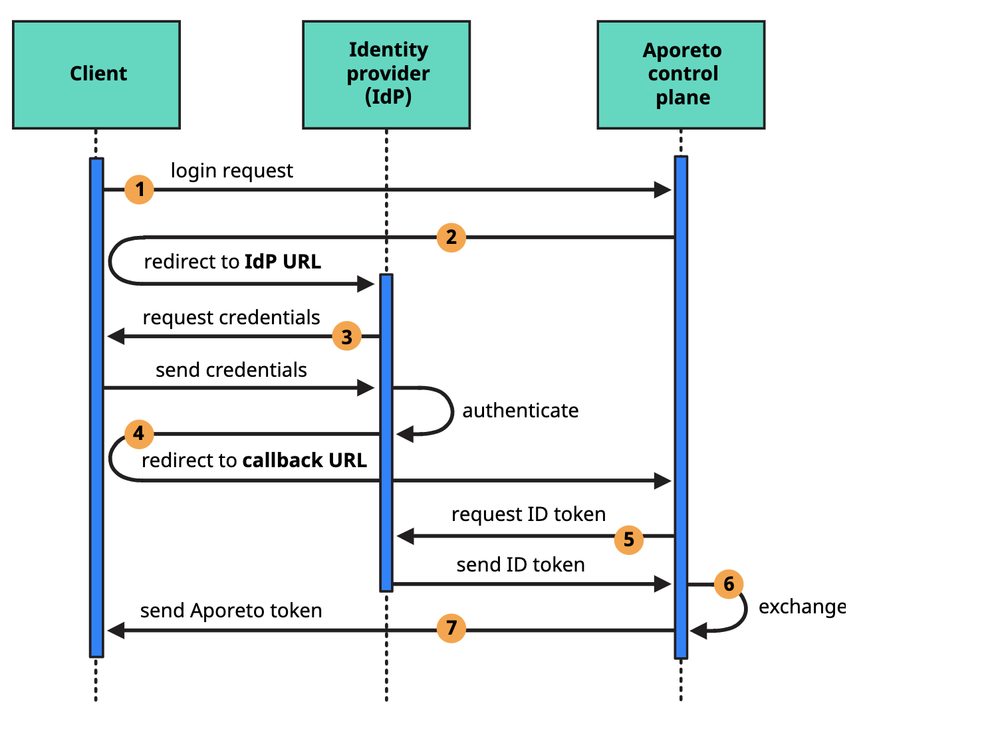
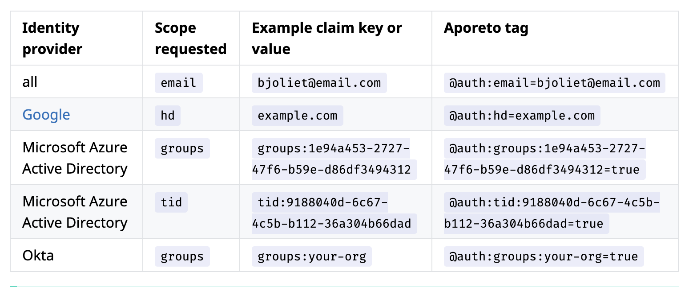

# Zero Trust Security
## Introduction
  This repo walks through the setup, configuration and scenarios of Aporeto Cloud PAM Solution. 
  (TODO : Couple of lines on the what is Cloud PAM and why is it a unique solution to a current challenge)

## What the demo does:

Demo of Cloud PAM with Aporeto. 
  1. Show how to ssh using two different IAM identities. 
  2. Show how the policies are applied based on the identity. 
  3. Show how to toggle policies in real time. 
  4. Show compliance, governance
  5. Show different types of attack vectors and how Aporeto Zero Trust handles them.

## Features and Value (from the Product Documentation)

[Product Documentation : SSH Overview](https://docs.aporeto.com/docs/main/guides/ssh/ssh-overview/) 

(TODO : Expand on each of the bullets below, and explain the value, what if scenario/how do you manage it today)

Aporeto allows you to manage, control, and monitor secure shell (SSH) access to remote hosts.

 * Aporeto certificate authority: Aporeto provides a certificate authority that signs and issues OpenSSH certificates using the ECDSA algorithm with a 256-bit key.

 * Single sign-on: Aporeto integrates with your existing identity provider, giving users single sign-on access to SSH certificates.

 * Short-lived certificates: Convenient access to certificates allows you to set short lengths of validity, giving users just enough time to accomplish a discrete task.

 * Local private keys: Users generate a local public-private key pair. The private key never goes over the wire. It's stored only on the user's local host, protected by file permissions and a password.

 * Namespaced access: Users can use the same certificate to access more than one remote host (Clarify - Multi Cloud?). For example, you can allow a user to access any server in the development environment but no servers in the production environment.

 * One-time server setup: Once you perform some initial configuration on the remote host, Aporeto manages the user certificates for you. You won't need to manually copy keys to the authorized_keys file anymore.

 * Monitoring, auditing, and alerts: Aporeto SSH certificates include custom extensions containing identity and namespace attributes, giving you context and visibility into user activity across hosts. You can access your logs through the Aporeto web interface or export them to the tool of your choice.

 * Restrict sudo access: Trusted users can issue sudo commands, each one logged for forensics and analysis. You can configure alerts for problematic commands, such as tampering with the Aporeto SSH controls.

 * Control connections: You can control SSH session communications with network policy.

## Sequence Diagram (from the Product Documentation)

The User Authorization sequence looks like the following




(TODO : Expand on each of the steps, with more details about the interaction, payload, who does what, dump of each packet communication to visualize the interaction)

1. The user sends their Aporeto token and public key, requesting an SSH certificate from the Aporeto certificate authority. (TODO: Show how the Aporeto token looks like.. )

2. The Aporeto control plane checks the role in the user's Aporeto token to determine whether they can request certificates. Then it checks the claims in the token against the SSH authorization. 

3. The Aporeto control plane returns an Aporeto SSH certificate containing the user's public key, signed by the Aporeto certificate authority, and the claims from the user's Aporeto token. (TODO: Give an example of the packet, showing all the above)

4. The client sends the Aporeto SSH certificate to the remote host, requesting a secure shell. (TODO: Is the Aporeto SSH Certificate, single cert or cert chain. Is the client Apoctl cli?)

5. The OpenSSH SSH daemon checks the signature on the certificate against its list of trusted certificate authorities. (TODO: Where is the list of trusted CAs installed/configured. What if the certificate chain, root CA is not Aporeto. Can we derive from a Corporate Root CA. )

6. The OpenSSH SSH daemon invokes the authorized principals binary, passing it the certificate. (TODO: This is for the SSH Verification. What about other types of sessions - RDP, Telnet?)

7. The authorized principals binary forwards the request to the enforcer, along with the claims from the user's certificate. (TODO: What is the authorized principals binary, is it from Aporeto or a binary on Linux host. How does it work with other Operating Systems. How does the Authorized principal binary know where is the enforcer)

8. The enforcer checks the user's claims against the SSH authorization. (TODO : How does it check, is it based on the cached policy. What kind of communication happens for this check)


## Installation and Configuration

### Dependencies
Install the following before you begin:
 * apoctl
    ```
        curl -o /usr/local/bin/apoctl \
        https://download.aporeto.com/releases/release-3.11.9/apoctl/darwin/apoctl
    ```
 * jq using homebrew, `brew install jq`
 * jwt (from jwt-cli)
 
    ```
        curl -o /usr/local/bin/apoctl \
        https://download.aporeto.com/releases/release-3.11.9/apoctl/darwin/apoctl
        
        brew mike-engel/jwt-cli
        brew install jq eksctl jwt-cli
        
    ```

## Configure User to sign in with OIDC 
[Product Documentation : Configuring OIDC for SSH and Aporeto control plane users](https://docs.aporeto.com/docs/main/guides/ssh/ssh-overview/) 

Note: If you have already setup Users to sign-in with OIDC, you can skip this section. 





1. Add Aporeto to the identity provider. 

   * Web application: Identity providers often support a variety of application types. If prompted, select web application.

   * Callback URLs: Supply the identity provider with the following whitelist of callback URLs. Identity providers sometimes refer to these as redirect URIs or login redirect URIs.

    ```
        https://console.aporeto.com/popup/oidc-verify
        http://localhost:65332
    ```
    * Client ID and client secret: The identity provider supplies a client ID and a client secret value. These values allow Aporeto to communicate with the identity provider. Store these values in a safe place. You'll need them in subsequent procedures.

    * Scopes: Though Aporeto sends the desired scopes in its request, some identity providers may ask you to identify the scopes during the configuration. 

        You can use scopes to request basic information about the user from the identity provider. If the user consents to the requested scopes, the identity provider returns the information to Aporeto as claims in an ID token. The claims in the ID token allow you to control which users can gain access.

        All identity providers should support the following list of scopes and claims.

        `profile` scope requests the following claims:

            name
            family_name
            given_name
            middle_name
            nickname
            preferred_username
            profile
            picture
            website
            gender
            birthdate
            zoneinfo
            locale
            updated_at

        `email` scope requests the following claims:

            email
            email_verified
        `address` scope requests the `address` claim

        `phone` scope requests the following claims:

            phone_number
            phone_number_verified

2. Confirm the identity provider's discovery endpoint.

    e.g. 
    
    Google as an OIDC (`export IDP_URL=https://accounts.google.com`)

    Okta as an OIDC (`export IDP_URL=https://dev-289699.okta.com/oauth2/default`)
 
    ```
    curl $IDP_URL/.well-known/openid-configuration

    e..g.

    curl $IDP_URL/.well-known/openid-configuration
    {
        "issuer": "https://accounts.google.com",
        "authorization_endpoint": "https://accounts.google.com/o/oauth2/v2/auth",
        "token_endpoint": "https://oauth2.googleapis.com/token",
        "userinfo_endpoint": "https://openidconnect.googleapis.com/v1/userinfo",
        "revocation_endpoint": "https://oauth2.googleapis.com/revoke",
        "jwks_uri": "https://www.googleapis.com/oauth2/v3/certs",
        "response_types_supported": [
            "code",
            "token",
            "id_token",
            "code token",
            "code id_token",
            "token id_token",
            "code token id_token",
            "none"
        ],
        "subject_types_supported": [
            "public"
        ],
        "id_token_signing_alg_values_supported": [
            "RS256"
        ],
        "scopes_supported": [
            "openid",
            "email",
            "profile"
        ],
        "token_endpoint_auth_methods_supported": [
            "client_secret_post",
            "client_secret_basic"
        ],
        "claims_supported": [
            "aud",
            "email",
            "email_verified",
            "exp",
            "family_name",
            "given_name",
            "iat",
            "iss",
            "locale",
            "name",
            "picture",
            "sub"
        ],
        "code_challenge_methods_supported": [
            "plain",
            "S256"
        ]
    }

    ```
3. Adding the identity provider to Aporeto

    * In the Aporeto web interface, expand Authentication Sources and select OIDC Providers.
    * Click the Create button to add a new identity provider.
    * Type the name of the identity provider in the Name field (e.g. Google or Okta )
    * In the Endpoint field, add the identity provider's URL. `echo $IDP_URL`
    * Paste the `client secret` in the Client Secret field and the `client ID` in the Client ID field.
    * Type the requested scopes in the Scopes field, pressing ENTER after each one. At a minimum, you must have `openid`. If the identity provider supports refresh tokens and you would like to enable this feature, also include the `offline_access` scope
    * To set this as the default identity provider, select Use this provider as the default.
    * Type the claims that correspond to the scopes you specified in the Scopes field, pressing ENTER after each one. This adds the values of the claims from the identity provider to the Aporeto token, allowing you to identify the user and determine whether or not to authorize them.

4. Creating an API authorization

    * Expand Namespace Settings, click Authorizations, and click the Create button.
    * Type a name for the policy.
    * If you want the user to have access to all of the children of the current namespace, select Propagate to child namespaces.
    * If you do not want this policy to be visible in the child namespaces, select Hide propagation to child namespaces.
    * Type @auth:realm=oidc in the Subject field and press ENTER. Then type the Aporeto tag that defines the value of the claim that must appear in the user's Aporeto token. Some examples follow.

    

    * Select the namespace that you want to allow the user to access from the Target Namespace list box. Click Next.

    * If you want to require the user to attempt their login from a certain subnet or subnets, specify the subnet or subnets in the List of authorized subnets field. Click Next.

    * Select the roles that the user should have. Click Create.

    Congratulations! The user should now be able to click **Sign in with OIDC** to access the Aporeto web interface and use `apoctl auth oidc` to log into apoctl.

  
## Install Aporeto Enforcer in an EC2 Host Instance


You can create an new EC2 host an install the enforcer using the following steps. 
On EC2 instances, we recommend configuring the Aporeto enforcer to authenticate using an AWS security token. Each instance must have an attached IAM role that allows read-only access to the AWS tags. You can use the AWS metadata of your choice to map the EC2 instances into the appropriate Aporeto namespaces

### Prerequsites

    * EC2 instance

        Set up to synchronize time with authoritative sources
        An IAM role attached
        Read-only access to tags: ec2:DescribeTags

    * Host other than the EC2 instance (such as your laptop)

        apoctl installed with namespace.editor privileges
        SSH access to the EC2 instance with sudo or root privileges

1. Set apoctl environment variables
        APOCTL_NAMESPACE: the base Aporeto namespace you want to use for your account/org
        NAMESPACE: the Aporeto namespace you want to use for the instance
        METADATA: the AWS metadata or tag to use to map the instance into the Aporeto namespace
        IAM_ROLE: the name of the IAM role attached to the instance
        AWS_ACCOUNT_ID: the identification number of your AWS account
        

    e.g. 
        export APOCTL_NAMESPACE=/aporeto
        export NAMESPACE=ec2
        export METADATA=type=ec2
        export IAM_ROLE=rolename=aporeto
        export AWS_ACCOUNT_ID=942613894219
    
2. Create the Aporeto namespace

    ```
    apoctl api create ns -k name $NAMESPACE
    ```

3. Create an API authorization

    Use the following command to create an API authorization that allows the Aporeto enforcer to access the Aporeto control plane.

        cat << EOF | apoctl api import -f -
        APIVersion: 0
        label: ec2-enforcerd-auth
        data:
        apiauthorizationpolicies:
        - authorizedIdentities:
            - '@auth:role=enforcer'
            authorizedNamespace: $APOCTL_NAMESPACE
            authorizedSubnets: []
            name: Authorize enforcer to access Aporeto control plane
            propagate: true
            subject:
            - - "@auth:$IAM_ROLE"
                - "@auth:realm=awssecuritytoken"
                - "@auth:account=$AWS_ACCOUNT_ID"
        EOF

4. Create a namespace mapping
    Use the following command to create a policy that maps the AWS instance into the desired Aporeto namespace.

        cat << EOF | apoctl api import -f -
        APIVersion: 0
        label: ec2-namespace-map
        data:
        namespacemappingpolicies:
        - mappedNamespace: $APOCTL_NAMESPACE/$NAMESPACE
            metadata: []
            name: Map $METADATA instance to $APOCTL_NAMESPACE/$NAMESPACE namespace
            subject:
            - - "\$identity=enforcer"
                - "@cloud:aws:$METADATA"
        EOF


## Demo Setup (One time)

1. Clone the Repo to your laptop

2. Add the current directory in your path. 

   ```
    export PATH=$PWD/bin:$PATH
   ```
3. Generate a key pair

   ```
   ssh-keygen -f ~/.ssh/aporeto-ecdsa -t ecdsa -b 521

   ```

4. SSH using Aporeto credentials (or IAM credentials of user) 


   ```
   cd aporeto
   xssh ssh
   ```

   The aporeto directory has a .pamconfig file which has the following info

   ```
   export APOCTL_API="https://api.console.aporeto.com"
   export APOCTL_NAMESPACE="/aporeto/se/v1"
   export SSH_KEY="~/.ssh/aporeto-ecdsa"
   export SSH_HOST="pamdemo.se.aporeto.io"
   export SSH_USER="admin"
   ```

   The SSH_HOST `pamdemo.se.aporeto.io` is the host you are trying to ssh into as the user `admin`

   The xssh ssh command does the following

5. Next, in another terminal window, SSH using another IAM user from gmail

   ```
   cd gmail
   xssh ssh
   ```


6. You will see two ssh session in the Aporeto console 

   

7. Aporeto IAM user has the network policies to curl to external website vs the gmail IAM user doesnt have network policies to curl  to external website
   
   ```
   curl -I http://www.google.com
   ```

8. Aporeto IAM user has the network policies to curl localhost vs the gmail IAM user doesnt have network policies to curl localhost

   
9. Pause the network policy for the Gmail User and curl. Toggle back and forth from the console. 

10. Check the flow logs and the access logs


# Additional Scenarios

1. Using the identity how do you access different hosts - development vs production
2. Restrict and allow Sudo access
3. 